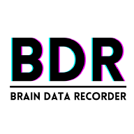

# BDR: Brain Data Recorder



#

## Maintainer Info

- **Owner**: [Leonardo Ferrisi](https://github.com/LeonardoFerrisi)
- **Objective**: *BDR* aims to solve the headache of performing the basic action of data collection with your specific biosensing board. Brainflow is excellent and removing the headache in connecting wireless-capable biosensing devices but has a barrier to entry for those not familiar with writing software to conduct their research / experiments. The solution *BDR* provides is a Graphical User Interface (GUI) that allows the user to select a device, and record data.* 
- **Audience**: Researchers and Developers using EEG and EMG equipment currently compatible with [Brainflow](https://brainflow.readthedocs.io/en/stable/SupportedBoards.html)
- **Maintainers**:
    - [LeonardoFerrisi](https://github.com/LeonardoFerrisi)
    - [alexfigtree](https://github.com/alexfigtree)
- **Technology Stack**:
    - JavaScript
        - React
        - ElectronJS
    - Python
        - brainflow
        - pandas
        - numpy
        - flask

*Data is saved in the Brain-Data-Format (BDF) or CSV


All features are a work in progress. Application is still in its Proof-Of-Concept stage.

> ## Warning: THIS APPLICATION IS UNSTABLE

# Setup
### Info

#### *Required Software*
- Python > v3.10
- NodeJs > v20.14.0

#### *This project relies on the following softwares primarily*:
- ElectronJS (for the application)
- ReactJS (for rendering the frontend)
- Axios (for communicating with the backend)
- Flask (for communicating with the frontend)
- Brainflow (for streaming data from biosensing devices)

**This app is still using a distributed architecture that requires several components to be initialized for a proper development enviornment.**

## Steps
To setup this application for yourself, follow the steps detailed below:

1. Clone this repo
2. In the root directory for `BrainDataRecorder` run `npm install`.
3. Change directories into `BrainDataRecorder//frontend` and run `npm install`.
4. Change directories into `BrainDataRecorder//backend` and run the following:

```bash
python -m venv .bdr_env
```
> **Note:** If on Windows, activate the `.bdr_env` with:
    `.bdr_env/Scripts/activate`

> **Note** If on Mac/Linux, activate the .bdr_env with: 
    `source .bdr_env/bin/activate`

*Once you have activated the environment for python, install all required packages located in* `BrainDataRecorders//backend//requirements.txt`
```bash
python -m pip install -r requirements.txt
```

### Note:
If you are on a Mac or Linux, you will need to change the following in `BrainDataRecorder/package.json`:

```json
"backend": "cd backend && cd bdr_env && cd Scripts && python ../../app.py",
```

to 

```json 
"backend": "cd backend && cd .bdr_env && cd bin && python ../../app.py",
```

5. Navigate to the root directory (**BrainDataRecorder//**), and run:

        npm run start

> **Note**: Data should be saved to `save_data` in the root directory when stopped. Reset currently only resets the clock. Dropdown is currently decorative until COM port logic is added.
# 
## Installing as an executable

Not yet implemented.

# 
